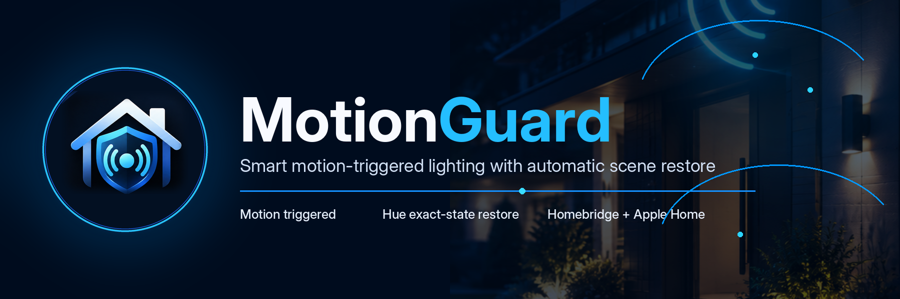

<p align="center">
  
</p>

<p align="center">
  <strong>Low-latency, state-preserving motion lighting for Philips Hue through Homebridge and Apple Home.</strong>
</p>

<p align="center">
  <a href="https://github.com/Tupling/homebridge-motionguard-hue/actions/workflows/ci.yml"></a>
  <a href="LICENSE"></a>
  
  
  
  
</p>

<p align="center">
  <a href="#how-it-works">How it works</a> ·
  <a href="#features">Features</a> ·
  <a href="#quick-start">Quick start</a> ·
  <a href="#apple-home-setup">Apple Home</a> ·
  <a href="#security-model">Security</a> ·
  <a href="CHANGELOG.md">Changelog</a> ·
  <a href="https://github.com/Tupling/homebridge-motionguard-hue/issues">Issues</a>
</p>

---

# MotionGuard for Hue

**MotionGuard for Hue** turns Philips Hue lights into responsive motion/security lighting without losing the scene that was already running.

When motion occurs, MotionGuard snapshots the selected Hue lights, applies a configurable bright-white motion state, extends the timer when more motion arrives, and restores the exact previous state when the event ends.

It is built for people who want **security-style lighting behavior without sacrificing normal Hue scenes, colors, brightness, or automations**.

> **Current release: v0.8.2**  
> Package/platform compatibility names remain `homebridge-hue-motion-restore` and `HueMotionRestore` so existing Homebridge configurations and Apple Home accessory identities continue to work.

v0.8.2 fixes HomeKit/HAP accessory-name warnings by publishing generated zone accessories as **`MotionGuard - <Zone Name>`** and sanitizing copied punctuation before handing names to HomeKit.

<p align="center">
  
</p>

<p align="center">
  Published by <strong>Nine 3 Digital, LLC</strong>; maintained by Dale Tupling.
</p>

## Why MotionGuard?

| Capability | MotionGuard for Hue |
| --- | --- |
| Trigger source | Any Apple Home / HomeKit-compatible motion source |
| Hue control | Local Hue API v2 |
| Motion response | Low-latency cached state + parallel writes |
| Restore behavior | Exact previous on/off, brightness, color temperature, and XY color where supported |
| Multi-zone support | Yes |
| Multi-service Hue fixtures | Yes |
| Restart recovery | Yes |
| Manual-change protection | Yes |
| Night-only mode | Yes |
| Apple Home controls | Minimal, Standard, or Advanced profiles |
| Cloud login required | No |
| Direct Ring login required | No |

## How it works

```text
Camera / motion sensor detects motion
                 │
                 ▼
Apple Home automation turns Motion Trigger ON
                 │
                 ▼
MotionGuard snapshots current Hue state
                 │
                 ▼
Selected lights switch to motion/security state
                 │
          more motion extends timer
                 │
                 ▼
Exact previous Hue state is restored
```

MotionGuard does **not** require a dedicated Ring connection. Ring cameras can be used through their existing Apple Home/Homebridge motion sensor, but the trigger can come from any HomeKit-compatible motion source.

## Features

### Exact-state restore

MotionGuard preserves the state that existed before motion:

- on/off state;
- brightness;
- color temperature;
- XY color where supported;
- original state across repeated motion events.

The first snapshot is retained while motion continues, so repeated triggers extend the timer instead of replacing the state that should eventually be restored.

### Low-latency Hue path

v0.8.1 retains the low-latency Hue improvements introduced in v0.8.0:

- persistent pinned-TLS Hue connections;
- Hue API v2 event-stream state caching;
- motion snapshots that normally avoid a fresh light-list GET when the live cache is healthy;
- parallel motion writes;
- parallel restore writes;
- per-trigger performance timing logs.

This makes it easier to distinguish Apple Home automation delay from MotionGuard/Hue processing time.

### Dynamic zones

Create independent zones such as:

- Garage
- Front Door
- Side Yard
- Patio
- Driveway

Each zone can have its own:

- Hue fixtures or individual light services;
- brightness;
- white temperature;
- restore delay;
- Night Only behavior;
- maximum override duration;
- enabled/paused state.

Zones use permanent internal IDs, so renaming a zone does not create a new HomeKit identity or break its Motion Trigger automation.

### Device-aware Hue discovery

The Homebridge settings UI discovers Hue API v2 devices and groups their controllable `light` services under the physical fixture.

This supports:

- standard single-service Hue fixtures;
- whole-fixture selection;
- individual light-service selection;
- multi-service fixtures;
- per-light-service brightness and white-temperature overrides;
- device UUID, model, firmware, service ID, and light-service UUID inspection.

The implementation follows the Hue API v2 device → light-service relationship rather than hard-coding specific fixture models.

> Multi-service behavior has simulated API coverage. Physical validation is still recommended for new multi-service fixture models.

### Apple Home exposure profiles

MotionGuard presents **one controller accessory per managed zone**.

**Standard — recommended**

- Enabled
- Night Only
- Pause
- Motion Trigger
- Override Active

**Minimal**

- Enabled
- Pause
- Motion Trigger

**Advanced**

- everything in Standard;
- Protect Manual Changes;
- Test;
- Restore Now.

Configuration-heavy controls remain in Homebridge so Apple Home stays focused on day-to-day operation.

### Restart recovery

Before an override, MotionGuard persists:

- original light state;
- expected motion state;
- override start time;
- restore deadline;
- hard-stop deadline.

If Homebridge restarts during an active override, MotionGuard recovers the saved state and either re-arms the remaining timer or restores immediately when appropriate.

### Shared-light protection

A Hue light may appear in more than one zone, but two active zones will not simultaneously take ownership of the same controllable light service.

If one zone already owns a light's active snapshot, a later zone safely skips that shared light until the first zone restores it.

---

## Requirements

- Homebridge **2.x**
- Node.js **22–26**
- Philips Hue Bridge reachable on the local network
- Hue API v2 application key
- Apple Home / HomeKit-compatible motion source
- Private or link-local Hue Bridge address

MotionGuard is designed to run locally alongside Homebridge.

## Quick start

### 1. Add the plugin to Homebridge

The compatibility package name is:

```text
homebridge-hue-motion-restore
```

The Homebridge platform identifier is:

```text
HueMotionRestore
```

If you are using this repository as a local plugin, keep the working plugin directory at:

```text
/var/lib/homebridge/local-plugins/homebridge-hue-motion-restore
```

### 2. Pair securely with the Hue Bridge

From the plugin directory:

```bash
npm run hue-link -- 192.168.1.25
```

Then:

1. verify the displayed Bridge ID;
2. press the physical button on the Hue Bridge;
3. press Enter when prompted;
4. save the returned Hue application key securely.

Existing MotionGuard / Hue Motion Restore upgrades do not require Hue re-pairing.

### 3. Open MotionGuard settings

In Homebridge:

**Plugins → MotionGuard for Hue → Settings**

The custom settings UI can:

- check Hue Bridge health;
- discover Hue devices and light services;
- create, remove, rename, reorder, enable, or stage zones;
- assign whole fixtures or individual light services;
- configure motion behavior;
- choose the Apple Home exposure profile.

### 4. Create a zone

Example:

```text
Garage
├── Garage Appear Left
└── Garage Appear Right

Front Door
├── Front Door Appear Left
└── Front Door Appear Right
```

A zone may be created while disabled and with zero Hue lights, allowing hardware to be installed later without creating placeholder devices.

### 5. Save and restart the child bridge

Configuration changes take effect after the Homebridge child bridge restarts.

---

## Apple Home setup

For each zone:

1. Open **Home → Automation → + → A Sensor Detects Something**.
2. Select the camera or motion sensor.
3. Choose **Detects Motion**.
4. Select the matching **MotionGuard - `<Zone Name>`** accessory.
5. Select its **Motion Trigger** service.
6. Set **Motion Trigger** to **ON**.
7. Save.

Do **not** add an OFF action. MotionGuard resets Motion Trigger automatically so the next motion event can trigger it again.

### Example

```text
Garage camera motion
        ↓
MotionGuard - Garage / Motion Trigger ON
        ↓
Garage Hue lights → configured motion state
        ↓
Override Active = detected
        ↓
restore previous state
        ↓
Override Active = clear
```

The trigger does not need to come from Ring. Any compatible Apple Home sensor, camera, or automation capable of switching Motion Trigger ON can initiate the zone.

---

## Operating modes

Configured from the MotionGuard Homebridge UI:

| Mode | Behavior |
| --- | --- |
| **Normal** | Uses normal settings and honors Night Only |
| **Night** | Bypasses Night Only while retaining configured brightness |
| **Away** | Allows automatic motion 24/7 and forces motion brightness to 100% |
| **Party** | Blocks automatic motion and restores active overrides |

### Pause

Pause is configured per zone from **5 minutes to 24 hours**.

Turning Pause on:

1. restores that zone if it is currently overridden;
2. blocks new automatic triggers;
3. automatically resumes when the pause period expires.

The pause deadline is persisted across Homebridge restarts.

---

## Protect Manual Changes

When enabled, MotionGuard avoids blindly restoring over a light that someone changed during an active motion override.

If current Hue state cannot be verified, restore is deferred and retried instead of overwriting the light immediately.

---

## Security model

Runtime Hue control and configuration discovery are intentionally local and narrowly scoped.

- Hue API v2 (`/clip/v2`) is used.
- The Hue application key is sent in the `hue-application-key` header, never in a URL.
- The configured Hue Bridge must use a private/link-local IP address.
- TLS 1.2 or newer is required.
- The Hue Bridge leaf certificate is pinned by SHA-256 fingerprint.
- Bridge certificate identity is verified against the configured Bridge ID.
- Fingerprint or Bridge ID mismatch blocks Hue traffic.
- There is no plaintext Hue fallback.
- Hue requests have an 8-second timeout.
- Oversized Hue responses are rejected.
- The runtime plugin opens no inbound listener and no additional TCP port.
- The browser configuration UI makes no direct network requests.
- The custom UI server exists only while the Homebridge settings UI is open.
- The UI server reuses the same pinned `HueClient` used by runtime control.
- The production UI helper dependency is the official `@homebridge/plugin-ui-utils` package pinned to `2.2.6`.
- The Hue application key is not intentionally written to logs.

The Homebridge host, router, Apple account/home hubs, Hue Bridge, and administrator credentials remain part of the security boundary.

**Do not port-forward Homebridge or Hue services to the Internet.**

### v0.8.1 security change

The experimental Direct Ring provider from v0.8.0 was removed after its WebRTC dependency chain triggered high-severity npm audit findings.

The Hue-side latency improvements remain in v0.8.1, and Apple Home Motion Trigger remains the supported trigger path.

---

## Backward compatibility

The user-facing product name is **MotionGuard for Hue**, while these compatibility identifiers remain unchanged:

```text
package:  homebridge-hue-motion-restore
platform: HueMotionRestore
```

Legacy configuration remains valid:

```json
"lights": [
  "Outdoor Spotlight 1"
]
```

Existing Hue pairing credentials, cached accessories, zone IDs, and Apple Home automation identities are preserved across supported upgrades.

The Dynamic Zone Manager can convert a legacy configuration into a managed zone while preserving the existing motion-trigger accessory identity.

---

## Ubuntu / native Homebridge local-plugin upgrade

Example workflow:

```bash
rm -rf ~/Downloads/hmr082
mkdir -p ~/Downloads/hmr082
unzip ~/Downloads/homebridge-hue-motion-restore-0.8.2.zip -d ~/Downloads/hmr082
cd ~/Downloads/hmr082/homebridge-hue-motion-restore

export PATH="/opt/homebridge/bin:$PATH"
npm run check
```

Replace the existing source:

```bash
sudo rsync -a --delete \
  ~/Downloads/hmr082/homebridge-hue-motion-restore/ \
  /var/lib/homebridge/local-plugins/homebridge-hue-motion-restore/

sudo chown -R homebridge:homebridge \
  /var/lib/homebridge/local-plugins/homebridge-hue-motion-restore
```

Install the pinned custom-UI helper as the Homebridge service user:

```bash
sudo -u homebridge env PATH="/opt/homebridge/bin:$PATH" \
  /opt/homebridge/bin/npm ci \
  --omit=dev \
  --ignore-scripts \
  --prefix /var/lib/homebridge/local-plugins/homebridge-hue-motion-restore
```

Restart Homebridge:

```bash
sudo hb-service restart
```

An existing symlink at:

```text
/var/lib/homebridge/node_modules/homebridge-hue-motion-restore
```

can remain in place.

---

## Self-test

Run:

```bash
npm run check
```

The check covers syntax and the project's test/validation path for:

- Hue state conversion and restore behavior;
- zone normalization and inheritance;
- dynamic/staged zones;
- stable trigger migration;
- restart persistence;
- Apple Home exposure profiles;
- custom UI discovery wiring;
- Hue device/service inventory normalization;
- bridge-health wrapping;
- private-address enforcement;
- TLS/certificate-pinning guardrails;
- Hue API v2 authentication;
- dependency/security guardrails.

For dependency auditing:

```bash
npm run security-check
```

CI runs through GitHub Actions on the supported project path.

---

## Current limitations

- Advanced Hue gradient segment/effect metadata is not currently snapshot/restored.
- Configuration changes take effect after the Homebridge child bridge restarts.
- Bridge health in the settings screen is checked when the UI is opened/refreshed; it is not a high-frequency background monitor.
- New multi-service fixture models should be physically validated even though the device/service architecture is generic.

---

## Publisher

MotionGuard for Hue is published by **Nine 3 Digital, LLC** and maintained by Dale Tupling.

The npm package name remains `homebridge-hue-motion-restore` for Homebridge compatibility and existing-user upgrades.

---

## Project links

- [Changelog](CHANGELOG.md)
- [Security policy](SECURITY.md)
- [Contributing](CONTRIBUTING.md)
- [Issue tracker](https://github.com/Tupling/homebridge-motionguard-hue/issues)
- [GitHub Actions](https://github.com/Tupling/homebridge-motionguard-hue/actions)
- [Support development](https://paypal.me/daletupling)

---

## Branding

Primary project assets are stored in [`branding/`](branding/).

- `banner.png` — README / project banner
- `icon.png` — MotionGuard icon
- `nine3-digital-logo.jpg` — Nine 3 Digital publisher logo
- `nine3-digital-logo-square.jpg` — square Nine 3 Digital publisher logo

---

MotionGuard for Hue is an independent Homebridge project and is not affiliated with or endorsed by Signify/Philips Hue, Apple, or Ring/Amazon.
